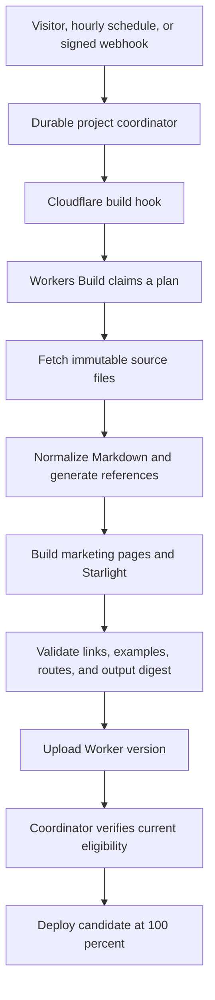

# Documentation architecture

cfgate.io renders released operator documentation with Starlight. The Worker selects sources and coordinates builds; Workers Builds compiles the site. No incoming request runs Astro.

## Release identity

Four identities remain separate:

| Identity                 | Source                                                |
| ------------------------ | ----------------------------------------------------- |
| Observed latest operator | Highest eligible published semantic version on GitHub |
| Desired documentation    | Immutable plan selected by the coordinator            |
| Uploaded candidate       | Worker version produced by one leased build           |
| Served documentation     | Manifest shipped with the responding Worker's assets  |

`src/docs/policy.ts` includes prereleases and excludes drafts and unpublished tags. Selection reads complete release pages, up to ten pages of 100 entries. Reaching that bound fails selection instead of assuming the first page contains the highest version. Annotated tags resolve to their commit. Previously observed release tags cannot change commits silently.

The coordinator waits for a released chart whose `appVersion` matches the operator. A newly observed operator can therefore appear in project information before its documentation is ready. A product `main` push does not select new documentation. A website `main` push changes the renderer and can rebuild the same product release.

The initial policy publishes English `latest` at `/docs/`. It generates no historical or `next` editions. Unknown edition URLs return 404. Contracts and fixtures support selective historical targets, with logical page IDs, separate routes and navigation, and edition search metadata. Production history remains disabled; adding it also requires enabling a version-scoped search interface.

The checked-in `docs/bootstrap.json` is a small pinned source selection for local builds and initial deployment. It contains no copied Markdown. It deliberately points to the released alpha.11 source, including its original prose, rather than the later documentation rewrite on product `main`.

## Build boundaries

`src/docs/contracts.ts` validates plans at HTTP and build boundaries. A build key hashes the renderer commit, source pins, targets, schema version and policy digest. The renderer commit covers its lockfile, templates, navigation and generators. Generation numbers and observation times do not change content identity.

`operatorSource` supplies CRD schemas and examples. `documentationSource` supplies prose and normally uses the same commit. A reviewed prose override must not replace the operator schema source. The runtime currently selects the same commit for both; custom plans are for local validation and initial deployment, not a public source-selection API.

## Content preparation

The preparer reads bounded GitHub trees and a selected set of regular files at pinned commits. It rejects traversal, symlinks, truncated trees, oversized files and unassigned Markdown pages. Sources stay in memory during preparation; only temporary generated Markdown and manifests reach the build workspace.

Markdown links and reference definitions are rewritten through a syntax tree. Documentation links use logical page IDs; other repository paths link to the pinned source revision. Code blocks remain verbatim. Badge-only paragraphs for live release, CI and coverage services are omitted: they describe mutable project state and could mislabel an older served edition. Imported content is Markdown, never executable MDX. HTML is sanitized, and imported SVGs receive a restrictive response policy. Local image filenames derive from their contents.

CRD reference pages describe parent-level required fields, nested objects, arrays, maps, defaults, enums, nullability and Kubernetes validation metadata. Generated schemas are cross-checked against the release's combined CRD asset when present. Authored behavioral guides remain intact; generated pages supplement their manual reference tables rather than guessing which prose to remove.

Complete cfgate YAML resources in Markdown and example files are checked against those released schemas, with schema defaults applied. The validator substitutes three explicit account/zone placeholder strings in its validation copy. It does not change published examples. Partial snippets are not standalone manifests; CEL expressions, live permissions and provider behavior require operator tests.

The matching chart contributes its installation guide and commented values. Annotation guidance remains product-authored.

Starlight supplies navigation, Pagefind and Expressive Code. The local integration adds source attribution, edition context and cfgate branding. The link validator checks Markdown links; the final assembler separately checks rendered routes and local assets. Marketing and docs have separate output/cache directories before assembly into `dist`.

## Runtime state

One SQLite-backed Durable Object stores the desired plan, last known good project information, current publication, pending publication intent, eight recent jobs, 64 recent source pins and up to 256 delivery receipts retained for a day. Conditional GitHub observations are bounded to 48 KB. No documentation bodies, historical snapshots, R2 objects, D1 tables or queues are retained.

Release and CI fetches fail independently. Failure preserves their last successful data and timestamps. Page requests return current stored data immediately and signal stale checking in the background. The access threshold is 30 minutes; a local one-minute signal throttle reduces duplicate messages but is not the global authority. An hourly Cron Trigger provides a backstop. Relevant signed webhook events request the same reconciliation operation.

The coordinator serializes source changes, build claims and publication decisions. It persists an alarm before state writes, so interrupted work has a wakeup. Build requests have a 30-minute lease and at most five automatic attempts per desired build. Failed builds retain the previous publication. A new desired build or explicit administrative rebuild resets that budget.

Publication writes intent before the Cloudflare deployment call. A timeout does not mean the deployment failed. The coordinator reads the active deployment and blocks newer publication until the recorded candidate is confirmed. This deliberately favors a retained site over an unverified replacement.

The guard coordinates this application's publication path. Manual dashboard deployments, external deploy tokens and the one-time infrastructure deployment can bypass it. Limit those paths operationally; this is not a platform-enforced global lock.

## Design system

`src/styles/tokens.css` owns shared color, typography, spacing, width, border, radius, focus and motion roles. Repeated values derive from a small set of bases. Homepage compositions remain in `global.css`; documentation maps shared roles to Starlight variables without importing homepage element rules.

The documentation retains Starlight's mobile navigation, search dialog and table of contents. Light and dark modes use paired surface/ink roles. New tokens should represent repeated responsibilities rather than name every isolated measurement.

## Upstream contracts

- [Starlight plugins](https://starlight.astro.build/reference/plugins/) configure rendering; they do not discover releases.
- [Workers deploy hooks](https://developers.cloudflare.com/workers/ci-cd/builds/deploy-hooks/) request builds. Their short queue deduplication does not replace build leases.
- [Worker versions and deployments](https://developers.cloudflare.com/workers/versions-and-deployments/) separate upload from activation.
- [Durable Object alarms](https://developers.cloudflare.com/durable-objects/api/alarms/) are delivered at least once; handlers must remain repeatable.
- [GitHub release APIs](https://docs.github.com/en/rest/releases/releases) distinguish published release lists from the stable-only latest endpoint.
