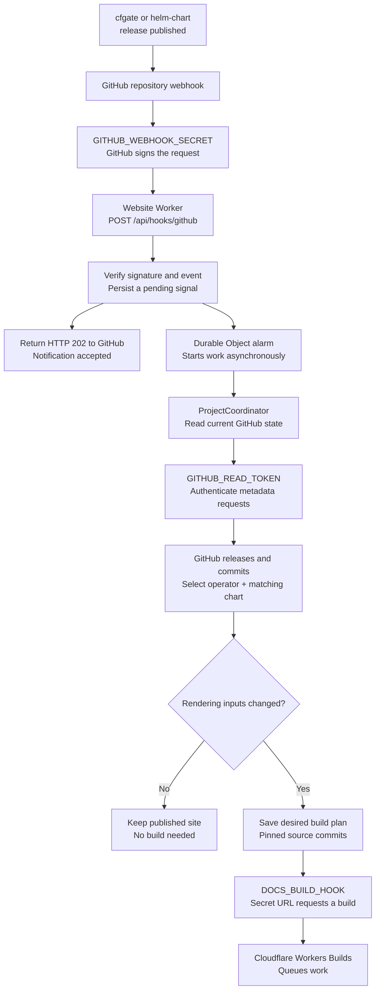
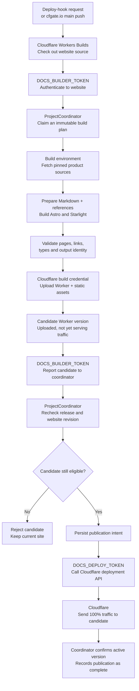
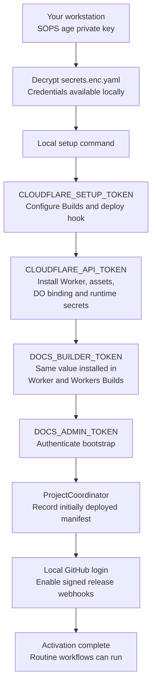
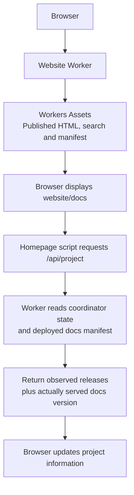

# Website system and architecture

cfgate.io serves the website, released documentation and project APIs through one Cloudflare Worker. A Durable Object coordinates source selection and publication; Cloudflare Workers Builds compiles the site. No visitor request runs Astro.

Read the flows below for the system boundaries, then use [Deployment and maintenance](operations.md) for the ordered setup, credential and recovery procedures. These are website-maintainer documents; operator installation guidance remains in the released product documentation.

## Responsibilities and storage

| Component                           | Responsibility                                                  | Stored material                                       |
| ----------------------------------- | --------------------------------------------------------------- | ----------------------------------------------------- |
| GitHub product repositories         | Author product guidance and publish releases                    | Markdown, schemas, examples and chart sources         |
| Website Worker                      | Serve requests, verify callers and route coordinator operations | Code, runtime bindings and secrets                    |
| `ProjectCoordinator` Durable Object | Select sources, coordinate builds and authorize publication     | Observations, plans, leases and publication intent    |
| Workers Builds                      | Prepare pinned sources, compile, validate and upload candidates | Temporary build workspace                             |
| Workers Assets                      | Serve the published site                                        | HTML, search index, assets and documentation manifest |
| GitHub Actions                      | Validate changes and scan dependencies/secrets                  | Workflow results; no production publication           |

The Durable Object class ships with the website Worker. Its instance is selected through `PROJECT_COORDINATOR.idFromName('project')` and retains storage across routine deployments. It is not a separately managed server or a Markdown store. Application credentials authenticate calls; they are never included in published content.

## Workflow diagrams

The following top-to-bottom Mermaid diagrams are maintained here as part of the repository's system overview.

### Release notification and source discovery

A release notification requests a check. It does not carry documentation or directly deploy anything.

An hourly Cron or stale visitor access can also signal the same coordinator. These are recovery paths when a webhook is missed. They do not make the visitor wait for a build. The coordinator can also wake through its own persisted alarms.

Normal source-observation freshness is 30 minutes. A relevant webhook requests a check sooner. A newly released operator needs a matching released chart before its documentation can be selected for a build.

### Build and guarded publication

A push to `cfgate.io/main` also starts this workflow. The production commands are `pnpm build` and `pnpm run deploy`.

Upload and publication are separate. The build environment produces a candidate; the coordinator decides whether it may become live. If deployment succeeds but its response is lost, persisted intent lets the coordinator check what actually happened. Unresolved publication blocks competing publication.

The deployed manifest identifies the documentation actually served. Observing a newer release does not relabel older HTML. Only the English latest edition is enabled; historical editions and `next` remain disabled.

GitHub Actions runs separate validation and security checks. It does not publish production, and Workers Builds does not wait for those Actions checks to pass.

### One-time activation

Activation establishes the connections and credentials used by routine workflows. This diagram summarizes responsibilities; setup also performs verification and can resume after partially completed steps.

These are resumable setup steps, not one atomic transaction across providers. Routine deployments retain the Durable Object's state and do not repeat activation.

`DOCS_DEPLOY_TOKEN` defaults to `CLOUDFLARE_API_TOKEN` unless an explicit publication credential is configured. The age private key is not required by Workers Builds or the website runtime.

### Visitor requests

The homepage requests project information once when loaded. It does not continuously poll an open tab. Static documentation can be served without requesting project information.

The Durable Object stores decisions, observations, and progress, not documentation bodies. GitHub stores source; the build environment transforms it; Workers Assets serves the result. No Astro build runs inside a visitor request.

## Release identity

Four identities remain separate:

| Identity                 | Source                                                |
| ------------------------ | ----------------------------------------------------- |
| Observed latest operator | Highest eligible published semantic version on GitHub |
| Desired documentation    | Immutable plan selected by the coordinator            |
| Uploaded candidate       | Worker version produced by one leased build           |
| Served documentation     | Manifest shipped with the responding Worker's assets  |

`src/docs/policy.ts` includes prereleases and excludes drafts and unpublished tags. Selection reads complete release pages, up to ten pages of 100 entries. Reaching that bound fails selection instead of assuming the first page contains the highest version. Annotated tags resolve to their commit. Previously observed release tags cannot change commits silently.

The coordinator examines the bounded release inventory for a chart whose `appVersion` matches the operator, without truncating it to the display list. Its successful source-check timestamp advances only after matching-chart selection and pin verification succeed. A newly observed operator can therefore appear in project information before its documentation is ready. A product `main` push does not select new documentation. A website `main` push changes the renderer and can rebuild the same product release.

The initial policy publishes English `latest` at `/docs/`. It generates no historical or `next` editions. Unknown edition URLs return 404. Contracts and fixtures support selective historical targets, with logical page IDs, separate routes and navigation, and edition search metadata. Production history remains disabled; adding it also requires enabling a version-scoped search interface.

The checked-in `docs/bootstrap.json` is a small pinned source selection for local builds and initial deployment. It contains no copied Markdown. It deliberately points to the released alpha.11 source, including its original prose, rather than the later documentation rewrite on product `main`.

## Build boundaries

`src/docs/contracts.ts` validates plans at HTTP and build boundaries. A build key hashes the renderer commit, source pins, targets, schema version and policy digest. The renderer commit covers its lockfile, templates, navigation and generators. Generation numbers and observation times do not change content identity.

`operatorSource` supplies CRD schemas and examples. `documentationSource` supplies prose and normally uses the same commit. A reviewed prose override must not replace the operator schema source. The runtime currently selects the same commit for both; custom plans are for local validation and initial deployment, not a public source-selection API.

## Content preparation

The preparer reads bounded GitHub trees and a selected set of regular files at pinned commits. It rejects traversal, symlinks, truncated trees, oversized files and unassigned Markdown pages. Sources stay in memory during preparation; only temporary generated Markdown and manifests reach the build workspace.

Markdown links and reference definitions are rewritten through a syntax tree. Documentation links use logical page IDs; other repository paths link to the pinned source revision. Unlisted Markdown links must name a file present in that pinned tree; missing pages fail preparation. Code blocks remain verbatim. Badge-only paragraphs for live release, CI and coverage services are omitted: they describe mutable project state and could mislabel an older served edition. Imported content is Markdown, never executable MDX. HTML is sanitized, and imported SVGs receive a restrictive response policy. Local image filenames derive from their contents.

CRD reference pages describe parent-level required fields, nested objects, arrays, maps, defaults, enums, nullability and Kubernetes validation metadata. Generated schemas are cross-checked against the release's combined CRD asset when present. Authored behavioral guides remain intact; generated pages supplement their manual reference tables rather than guessing which prose to remove.

Complete cfgate YAML resources in Markdown and example files are checked against those released schemas, with schema defaults applied. The validator substitutes three explicit account/zone placeholder strings in its validation copy. It does not change published examples. Unknown cfgate API versions or kinds fail validation; other Kubernetes resource types remain outside this schema check. Partial snippets are not standalone manifests; CEL expressions, live permissions and provider behavior require operator tests.

The matching chart contributes its installation guide and commented values. Annotation guidance remains product-authored.

Starlight supplies navigation, Pagefind and Expressive Code. The local integration adds source attribution, edition context and cfgate branding. The link validator checks Markdown links; the final assembler separately checks rendered routes and local assets. Marketing and docs have separate output/cache directories before assembly into `dist`.

## Runtime state

One SQLite-backed Durable Object stores the desired plan, last known good project information, current publication, pending publication intent, eight recent jobs, 64 recent source pins and up to 256 delivery receipts retained for a day. Conditional GitHub observations are bounded to 48 KB. No documentation bodies, historical snapshots, R2 objects, D1 tables or queues are retained.

Authenticated documentation metadata selection uses `GITHUB_READ_TOKEN`. The separate display-data loader, including CI status, and public raw-source downloads still use unauthenticated requests. Release and CI fetches fail independently. Failure preserves their last successful data and timestamps. Page requests return current stored data immediately and signal stale checking in the background. A coordinator outage uses the existing cached/snapshot display-data fallback. A failed manifest read omits served identity rather than guessing it or discarding valid project observations. The access threshold is 30 minutes; a local one-minute signal throttle reduces duplicate messages but is not the global authority. An hourly Cron Trigger at minute 17 provides a backstop. Persisted alarms normally wake every five minutes to evaluate pending work, or every minute during uncertain publication; wakeups do not necessarily fetch sources. Relevant signed webhook events request the same reconciliation operation.

The coordinator serializes source changes, build claims and publication decisions. It persists an alarm before state writes, so interrupted work has a wakeup. Alarm scheduling preserves an earlier webhook wakeup in a storage transaction. Build requests have a 30-minute lease and at most five automatic attempts per desired build. Failed preparation retains the previous publication. A reported publication failure can follow a successful deployment; recovery verifies the active version. A new desired build or explicit administrative rebuild resets that budget.

Publication writes intent before the Cloudflare deployment call. A timeout does not mean the deployment failed. The coordinator reads the active deployment and blocks newer publication until the recorded candidate is confirmed. This deliberately favors a retained site over an unverified replacement.

The guard coordinates this application's publication path. Manual dashboard deployments, external deploy tokens and the one-time infrastructure deployment can bypass it. Limit those paths operationally; this is not a platform-enforced global lock.

## Design system

`src/styles/tokens.css` owns shared color, typography, spacing, width, border, radius, focus and motion roles. Repeated values derive from a small set of bases. Homepage compositions remain in `global.css`; documentation maps shared roles to Starlight variables without importing homepage element rules.

`src/components/Wordmark.astro` renders the marketing header/footer, project-page header and Starlight site title. Shared tokens define its type, sizes and accent color; light documentation themes use the accessible accent ink. The `SiteTitle` override preserves Starlight's documentation-home URL, while marketing links retain their locale. The plain `title` configuration still supplies metadata and accessible naming.

The documentation retains Starlight's mobile navigation, search dialog and table of contents. Light and dark modes use paired surface/ink roles. New tokens should represent repeated responsibilities rather than name every isolated measurement.

## Upstream contracts

- [Starlight plugins](https://starlight.astro.build/reference/plugins/) configure rendering; they do not discover releases.
- [Workers deploy hooks](https://developers.cloudflare.com/workers/ci-cd/builds/deploy-hooks/) request builds. Their short queue deduplication does not replace build leases.
- [Worker versions and deployments](https://developers.cloudflare.com/workers/versions-and-deployments/) separate upload from activation.
- [Durable Object alarms](https://developers.cloudflare.com/durable-objects/api/alarms/) are delivered at least once; handlers must remain repeatable.
- [GitHub release APIs](https://docs.github.com/en/rest/releases/releases) distinguish published release lists from the stable-only latest endpoint.
